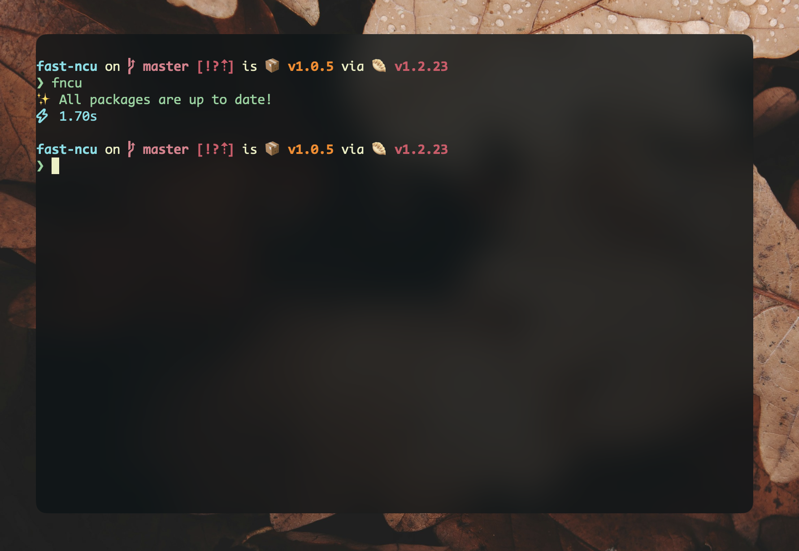

<p align="center"><code>npm i -g fast-ncu</code><br />or <code>bun install -g fast-ncu</code></p>

<p align="center"><strong>fncu</strong> (fast-ncu) is a blazing-fast CLI tool for checking npm package updates, built with Bun for maximum performance.</p>

<p align="center">
  
</p>

---

## Quickstart

### Installation

```bash
# Using npm
npm install -g fast-ncu

# Using Bun
bun install -g fast-ncu
```

### Basic Usage

```bash
# Check for updates
fncu

# Update package.json
fncu -u

# JSON output
fncu --json

# Filter packages
fncu --filter "react|typescript"
```

## ✨ Features

- ⚡ **Ultra-fast** - Parallel fetching with intelligent batching
- 🎯 **Smart filtering** - Filter packages by name using regex
- 📊 **Multiple formats** - Human-readable table or JSON output
- 🎛️ **Flexible targeting** - Choose update level: major, minor, or patch
- 🔄 **Auto-upgrade** - Update package.json with latest versions
- 💾 **Intelligent caching** - Avoid redundant API calls
- 🔧 **Package manager detection** - Auto-detect npm, yarn, pnpm, or bun

## 📖 Usage

### Command Line Options

| Option               | Short | Description                              | Default |
| -------------------- | ----- | ---------------------------------------- | ------- |
| `--upgrade`          | `-u`  | Upgrade package.json dependencies        | `false` |
| `--filter <pattern>` | `-f`  | Filter packages by name (regex)          | -       |
| `--json`             | `-j`  | Output as JSON                           | `false` |
| `--target <level>`   | `-t`  | Update target: auto, major, minor, patch | `auto`  |
| `--workspaces`       | `-w`  | Check workspaces                         | `false` |

### Examples

#### Check for updates

```bash
fncu
```

```
📦 3 updates available:

┌─────────────┬─────────────┬─────────────┬─────────┐
│ Package     │ Current     │ Latest      │ Type    │
├─────────────┼─────────────┼─────────────┼─────────┤
│ react       │ 18.0.0      │ 18.2.0      │ minor   │
│ typescript  │ 4.9.0       │ 5.0.0       │ major   │
│ lodash      │ 4.17.20     │ 4.17.21     │ patch   │
└─────────────┴─────────────┴─────────────┴─────────┘

💡 Run: fncu -u to update
⚡ 0.45s
```

#### Update with filtering

```bash
fncu -u --filter "react|typescript" --target minor
```

#### JSON output

```bash
fncu --json
```

```json
{
  "updates": [
    {
      "name": "react",
      "current": "^18.0.0",
      "latest": "^18.2.0",
      "diff": "+0.2.0",
      "type": "minor"
    }
  ],
  "total": 15,
  "upgraded": false
}
```

## 🛠️ Development

### Prerequisites

- [Bun](https://bun.sh) latest
- Node.js v22 or later

### Setup

```bash
git clone https://github.com/uchkunrakhimow/fast-ncu
cd fast-ncu
bun install
```

### Scripts

```bash
# Development with hot reload
bun run dev:watch

# Run tests
bun test

# Build for production
bun run build
```

---

## 📚 Documentation

- [**Usage Guide**](./docs/usage.md) - Detailed usage examples
- [**Contributing**](./docs/contributing.md) - How to contribute

---

## 📄 License

This project is licensed under the [MIT License](LICENSE).
